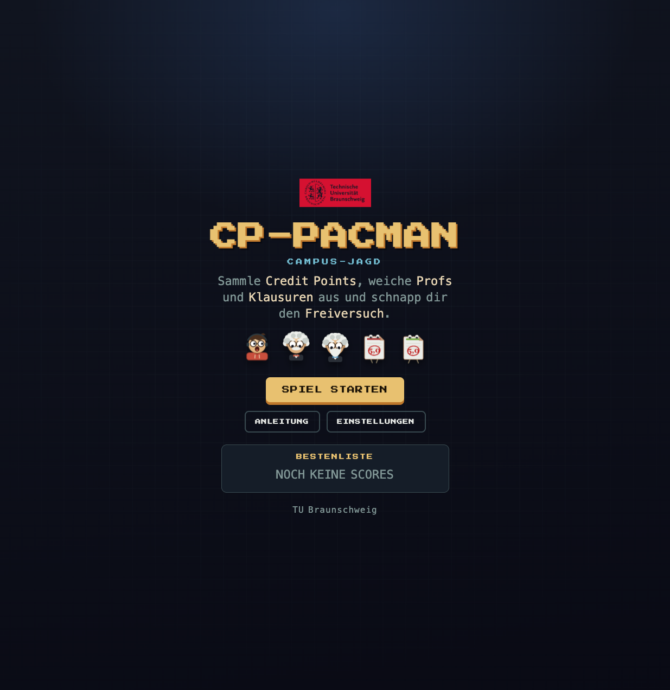
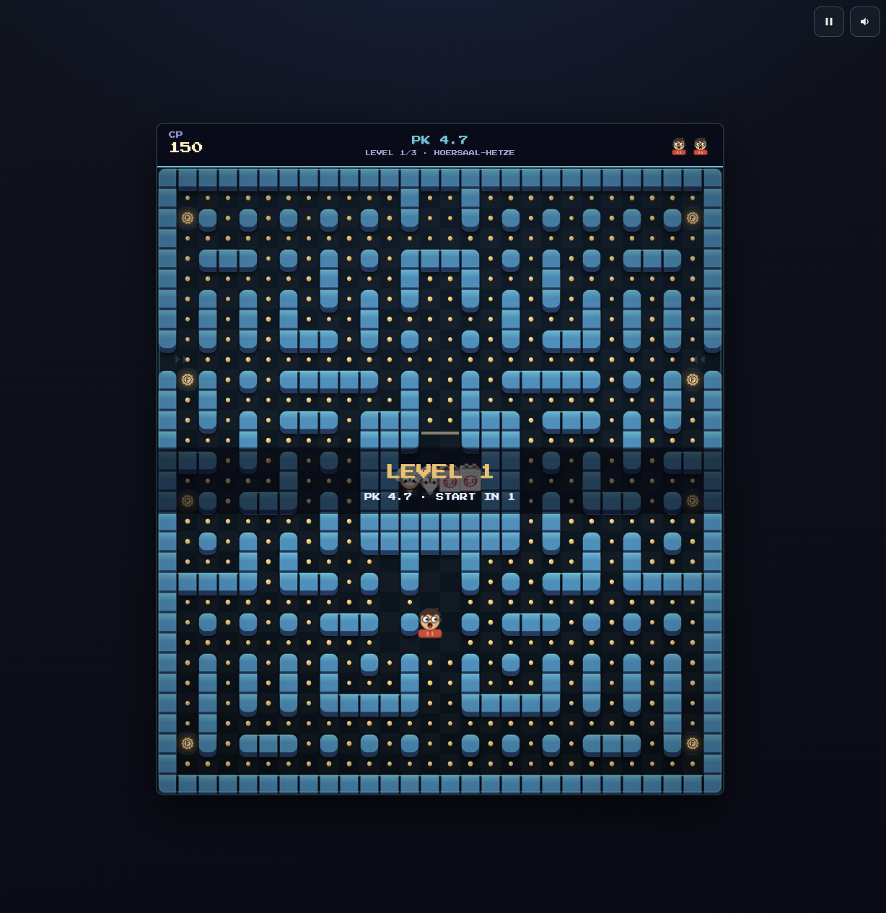

# CP-Pacman · Campus-Jagd





## What this is

CP-Pacman is a browser-based Pacman clone built for a university trade-fair
booth (Messe). The player is a student navigating a campus-building maze,
collecting CP (credit point) pellets while avoiding Profs and Prüfungen
(exams), four enemies with distinct chase behaviors. It runs locally on a
booth laptop via a small Node.js server and is meant to be launched with a
single double-click. The leaderboard is session-only: it lives in the
server's memory and starts empty every time the server is launched.

## Requirements

- Node.js 18 or newer.
- Google Chrome recommended, for kiosk (fullscreen) mode.
- No internet connection required after the first `npm install`. All game
  assets are local; the leaderboard is held in server memory, no database
  and no files on disk.

## Setup (first time only)

1. Copy the whole project folder onto the booth laptop.
2. Run the installer script once:
   - Windows: double-click `install_windows.bat`
   - Mac: double-click `install_mac.command`

   This installs dependencies (`npm install`) and starts the game automatically.

   Manual alternative, from a terminal in the project folder:
   ```
   npm install
   node server.js
   ```
   then open `http://localhost:3000` in a browser.

## Running at the booth

Double-click `install_windows.bat` (Windows) or `install_mac.command` (Mac).
The server starts and the game opens in Chrome in kiosk (fullscreen) mode
automatically. If Chrome isn't installed, it falls back to opening the page
in your system's default browser instead.

To exit kiosk mode: **Alt+F4** (Windows) or **Cmd+Q** (Mac).

The game runs itself between visitors: after 60 seconds of idle on the
title screen, a demo plays behind a "DRUECK EINE TASTE" banner to draw
people in. Any key or click returns to the menu. After a game over, names
are entered arcade-style with the arrow keys (typing works too), and the
screen returns to the menu on its own after 30 seconds of inactivity.

## Leaderboard

The leaderboard is temporary by design. Scores live in the server's memory
for the current session only: restarting the server (or the laptop, or
re-running the installer script) clears the board back to empty. Nothing is
written to disk, so there is nothing to reset between events.

## Controls

Arrow keys or WASD to move. Enter or Space starts a game from the title
screen, P or Esc pauses. Name entry after a game over uses the arrow keys
(up/down changes the letter, left/right moves, Enter saves); normal typing
works as well.

## Known constraints

- The server binds to `127.0.0.1` (localhost) only, so it is not reachable
  from other machines on the network.
- Single-machine, single-player use. No multiplayer or network sync between
  booths.
- No mobile/touch controls; keyboard only.

## Troubleshooting

- **Port 3000 already in use**: run the server on a different port with
  `PORT=3001 node server.js` (and open `http://localhost:3001` instead).
- **"Node.js not found" error**: install Node 18+ from
  [nodejs.org](https://nodejs.org) (or `brew install node` on Mac), then
  re-run the installer script.
- **Chrome not found (Windows)**: the installer falls back to opening the
  game in your default browser via `start http://localhost:3000`; the game
  still works, just not in kiosk mode.
